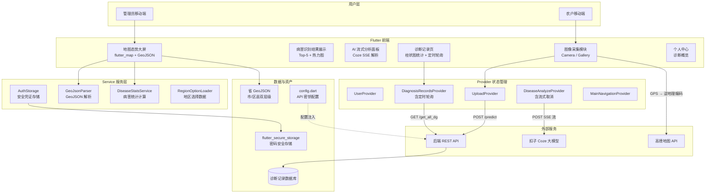
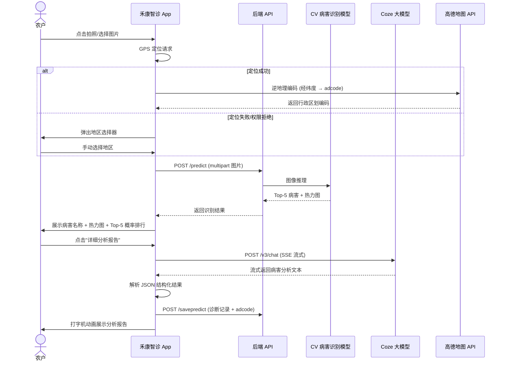
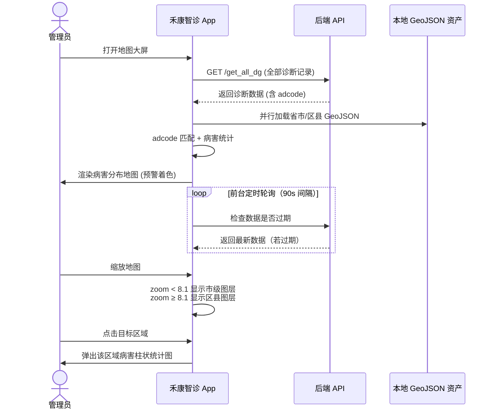

# 禾康智诊 — 农作物病害智能诊断平台

## 一、作品名称

**禾康智诊**（Wisdom Farm Remedy）—— 基于 AI + 地理信息系统的农作物病害智能诊断与防治决策平台

| 属性     | 说明                                       |
| -------- | ------------------------------------------ |
| 项目代号 | `farm_flutter`                             |
| 版本     | v1.0.0+1（Alpha）                          |
| 开发框架 | Flutter (Dart) SDK ^3.11.4                 |
| 目标平台 | Android / iOS                              |
| 目标用户 | 农业种植户（农户）、农业管理部门（管理员） |

---

## 二、创意说明

### 2.1 背景与痛点

我国是农业大国，农作物病害是影响粮食安全和农民收入的关键因素。然而，当前农业生产中存在以下突出问题：

- **诊断滞后**：农户发现病害时往往已进入中晚期，错过最佳防治窗口
- **知识断层**：基层农技人员短缺，农户缺乏专业的病害识别和防治知识
- **信息孤岛**：病害发生数据分散，农业管理部门难以掌握区域内病害分布态势
- **响应缓慢**：从发现病害到获取专业防治建议，传统链路耗时长、成本高

### 2.2 解决思路

禾康智诊以"**拍照即诊断 + AI 深度分析 + 地图态势感知**"三位一体，构建了一条从田间到决策的完整智能化链路：

1. **前端感知层**：农户在田间拍照上传作物叶片图像
2. **视觉识别层**：后端深度学习模型对图像进行病害分类，输出 Top-5 置信度排序
3. **智能分析层**：对接扣子（Coze）大语言模型智能体，对病害进行结构化深度分析，涵盖病因、症状、规律、防治方案
4. **空间决策层**：将诊断数据与地理位置绑定，通过 GeoJSON 地图可视化，为管理部门提供区域病害态势一张图

### 2.3 设计理念

应用 UI 采用 **Anthropic Claude 设计系统**——暖色调奶油画布（`#FAF9F5`）配合珊瑚色点缀（`#CC785C`），衬线体标题搭配人文主义无衬线正文，营造**温暖、可信赖的农业科技产品气质**，区别于传统农业应用的功能堆砌风格。

---

## 三、关键创新点

### 3.1 "CV + LLM" 双模型协同诊断

| 阶段         | 模型/服务                    | 输入         | 输出                                                                    |
| ------------ | ---------------------------- | ------------ | ----------------------------------------------------------------------- |
| **视觉识别** | 后端深度学习模型（图像分类） | 作物叶片照片 | Top-5 病害类别 + 置信度 + 热力图                                        |
| **语义分析** | 扣子 Coze 大语言模型智能体   | 病害名称     | 结构化 JSON：病害类型、致病病原、危害部位、病害症状、发病规律、防治方法 |

与传统仅输出单一分类标签的方案不同，禾康智诊将 CV 模型的分类结果作为 LLM 智能体的上下文输入，触发**多维度语义推理**，一次性输出从病因到防治的完整决策链。分析结果以 SSE（Server-Sent Events）流式返回，用户可实时看到 AI 逐字生成内容，大幅降低等待焦虑。

### 3.2 空间地理可视化病害态势感知

- **双层级行政区划渲染**：同时加载省市级与区县级两套 GeoJSON 图层，根据地图缩放级别（阈值 8.1 / 9.6）自动切换
- **数据驱动动态着色**：从后端诊断记录中提取 `adcode` 行政编码，匹配 GeoJSON 区域，有病害数据的区域以预警色渲染，无数据区域弱化显示
- **点击交互统计**：点击任意行政区弹出该地区病害分布柱状图（fl_chart），实现"宏观态势 → 微观详情"的下钻
- **防越界约束**：地图采用弹性回弹相机约束，确保视图始终锁定在省级范围内

### 3.3 诊断数据与地理位置精确绑定

在每次拍照诊断时，同步获取 GPS 坐标并调用高德地图 Web API 进行**逆地理编码**，将经纬度转换为标准化行政区划编码（`adcode`），随诊断记录一同存储。定位失败时自动弹出地区选择器供用户手动选择，确保每条记录都具备空间属性。

### 3.4 端到端流式交互体验

- **流式文本推送**：Coze API SSE 事件流被实时解析，通过 `ValueNotifier` 驱动 UI 增量更新，字符以 80ms 节流刷新
- **打字机效果**：分析完成后，病因分析和防治建议以打字机逐字动画呈现，每条建议依次展开，增强阅读节奏
- **文本高亮**：关键病害信息（严重程度、核心防治措施等）以珊瑚色自动高亮标记

### 3.5 诊断数据定时轮询

管理员端诊断记录支持**定时轮询 + 生命周期联动**刷新：

- 前台时每 90 秒自动检查数据是否过期（超过 60 秒未更新），过期则自动拉取
- App 切后台时暂停轮询，恢复前台时立即刷新一次
- 下拉刷新作为手动强制刷新兜底
- 基于 `_fetchGeneration` 计数器防止竞态条件下的旧数据覆盖新数据

---

## 四、系统逻辑架构



---

## 五、核心业务流程图

### 5.1 农户拍照诊断流程



### 5.2 管理员地图态势感知流程



---

## 六、数据模型设计

### 6.1 诊断记录模型 `Diagnosis`

| 字段       | 类型    | 说明                            |
| ---------- | ------- | ------------------------------- |
| `id`       | int     | 诊断记录唯一标识                |
| `imgname`  | String  | 上传图片文件名                  |
| `bhname`   | String  | 病害名称（CV 模型识别结果）     |
| `bhreason` | String  | 致病病原（Coze AI 分析结果）    |
| `bhadvice` | String  | 防治建议（Coze AI 分析结果）    |
| `username` | String  | 提交诊断的农户用户名            |
| `location` | String? | 行政区划编码（高德 adcode）     |
| `dtime`    | String  | 诊断时间（ISO 8601 / RFC 1123） |

### 6.2 识别结果模型 `PredictionResult`

| 字段           | 类型           | 说明                                   |
| -------------- | -------------- | -------------------------------------- |
| `result`       | String         | 置信度最高的病害类别                   |
| `heatmapData`  | String?        | 热力图 base64 编码                     |
| `top5Classes`  | List\<String\> | Top-5 病害类别名称                     |
| `predictTop5`  | List\<double\> | Top-5 对应置信度                       |
| `displayCount` | int (getter)   | 实际显示数量（min(类别数, 概率数, 5)） |

### 6.3 地图区域模型

```
GeoDataBundle
├── regions: List<GeoRegion>     # 区域集合
│   ├── id: String               # 行政区划编码 (adcode)
│   ├── name: String             # 行政区名称
│   ├── level: String            # 层级 (city / district)
│   ├── parentAdcode: String?    # 父级编码 (区县→市)
│   ├── center: LatLng           # 区域中心坐标 (标签定位)
│   └── polygons: List<GeoPolygonData>
│       ├── outer: List<LatLng>  # 多边形外轮廓
│       └── holes: List<List<LatLng>>  # 内部孔洞
└── bounds: LatLngBounds?        # 全部区域外包络矩形
```

### 6.4 Coze AI 智能体输出 JSON 结构

```json
{
  "病害类型": "苹果黑斑病",
  "致病病原": "链格孢菌 (Alternaria alternata)",
  "危害部位": "叶片、果实",
  "病害症状": {
    "初期": "叶片出现圆形或不规则褐色小斑点",
    "中期": "病斑扩大呈同心轮纹，边缘紫褐色",
    "后期": "病斑联合导致叶片枯焦脱落"
  },
  "发病规律": "高温高湿环境易发病，6-8 月为发病高峰，借风雨传播",
  "防治方法": {
    "农业防治": "合理修剪通风透光，清除病残体减少菌源",
    "化学防治": "发病初期喷洒代森锰锌或吡唑醚菌酯，间隔 7-10 天"
  }
}
```

---

## 七、界面效果说明

### 7.1 登录页

采用 Claude 设计系统的"编辑级"极简风格：48px 衬线体双行标题（"Sign in to continue."），16px 大写字母间距副标题（"欢迎回到禾康智诊"），下划线式输入框 + 零圆角黑色登录按钮。支持角色选择（管理员/农户）、记住密码自动登录（密码通过 `flutter_secure_storage` 安全存储）。

### 7.2 农户首页

- **顶部**：衬线体大标题"病理分析" + 右上角用户名
- **图像诊断区**：全宽黑色边框上传容器（180px 高），点击弹出拍照/相册选择底部面板；上传后展示病害识别结果行（"识别类别 — XX病"），下方依次为原图与热力图的对比展示、Top-5 概率排行进度条、零圆角"详细分析报告"按钮
- **功能卡片区**：三张米色功能卡片（诊断记录、病害百科、专家咨询），2px 圆角
- **农业资讯**：图文新闻列表，含标题、时间、阅读量

### 7.3 AI 分析结果页

- **病害名称卡片**：全宽珊瑚色左侧色条 + 病害名称标题
- **病因分析区**：红色竖条标题装饰 + 浅米色背景分析容器，流式文本实时滚动显示，分析完成后切换为打字机逐字动画效果
- **防治建议区**：每条建议以独立卡片展示，带 Coral 色左侧边框，依次以打字机效果展开
- 关键病害信息自动高亮（珊瑚色标注严重程度、红色标注高危病原）
- **安全防护**：Provider dispose 时自动取消 SSE 流和打字机 Timer，防止内存泄漏

### 7.4 诊断记录页

- **病害统计柱状图**：基于 fl_chart 的水平柱状图，按病害名称分组统计频次，7 种颜色轮排
- **记录列表**：每条记录卡片含病害名称、诊断时间、严重程度徽章（高危红 / 中等琥珀 / 轻微绿），点击展开显示致病病原和防治建议详情
- **角色过滤**：农户仅看自己的记录，管理员可查看全部
- **下拉刷新** + 后台恢复自动刷新

### 7.5 管理员地图大屏

- **基础底图**：OpenStreetMap 瓦片 + flutter_map 渲染引擎
- **GeoJSON 图层**：省、地级市及下辖区县多边形自动分层渲染（并行加载）
- **预警着色**：有病害数据的区域以珊瑚琥珀渐变色填充；无数据区域以浅灰色半透明填充
- **缩放切换**：zoom < 8.1 显示市级图层（粗粒度），zoom ≥ 8.1 显示区县图层（细粒度），zoom ≥ 9.6 显示区县详情标签
- **区域标签**：各行政区名称以文字标记固定在区域几何中心
- **交互弹窗**：点击区域弹出病害统计柱状图（`DiseaseChartMarker` 组件）
- **防越界**：弹性回弹相机约束，视图不超出省级边界
- **性能优化**：多边形/标记列表缓存，仅在图层切换或选区变化时重建

### 7.6 个人中心

- **用户信息区**：头像 + 昵称 + 角色标签
- **数据概览**：大号数字展示诊断总数和已识别病害种类数（数据复用 `DiagnosisRecordsProvider`）
- **快捷入口**：诊断记录入口
- **退出登录**按钮（安全清理 `flutter_secure_storage` 凭证）

---

## 八、成果影响

### 8.1 对农户的价值

- **降低诊断门槛**：不需要专业知识，拍照即可获得 AI 级病害识别和防治方案
- **缩短响应时间**：从发现异常到获取专业建议，整个流程压缩至分钟级
- **减少农药滥用**：精准识别病害 + 针对性用药建议，避免盲目喷洒
- **积累个人诊断档案**：历史记录可追溯，便于掌握地块病害规律

### 8.2 对管理部门的价值

- **区域病害态势一张图**：市/区县两级病害分布可视化，辅助精准决策
- **数据驱动预警**：基于历史诊断数据的时空分布规律，预判高风险区域
- **靶向技术指导**：根据各区域高频病害类型，定向推送防治知识
- **降低基层巡田成本**：农户自主上报替代人工巡检，提升监测效率

### 8.3 技术可扩展性

- **跨作物适配**：后端 CV 模型支持热替换，可扩展至小麦、水稻、玉米、蔬菜等多种作物
- **跨区域覆盖**：替换本地 GeoJSON 资产即可适配其他省份的行政区划地图
- **多语言模型接入**：Coze 智能体可替换为通义千问、文心一言、DeepSeek 等国内大模型
- **多端部署**：Flutter 跨平台能力天然支持 iOS 同步发布

---

## 九、技术栈详情

| 类别        | 技术                   | 版本                | 用途                               |
| ----------- | ---------------------- | ------------------- | ---------------------------------- |
| 跨平台框架  | Flutter (Dart)         | SDK ^3.11.4         | 移动端 UI 与业务逻辑               |
| 状态管理    | Provider               | ^6.1.2              | 响应式状态管理                     |
| HTTP 客户端 | Dio                    | ^5.9.2              | REST API + SSE 流式请求            |
| 图片选择    | image_picker           | ^1.2.1              | 相机拍照 / 相册选图                |
| 本地持久化  | shared_preferences     | ^2.5.5              | 用户偏好缓存                       |
| 安全存储    | flutter_secure_storage | ^10.3.1             | 密码安全存储（RSA OAEP + AES-GCM） |
| 地图引擎    | flutter_map + latlong2 | ^8.3.0 / ^0.10.1    | OpenStreetMap 底图 + GeoJSON 渲染  |
| GPS 定位    | geolocator             | ^14.0.2             | 获取设备经纬度                     |
| 数据图表    | fl_chart               | ^1.2.0              | 病害分布柱状图                     |
| AI 大模型   | 扣子 Coze API          | api.coze.cn/v3      | SSE 流式智能对话                   |
| 逆地理编码  | 高德地图 Web API       | restapi.amap.com/v3 | 经纬度 → adcode                    |
| 后端服务    | 自建 REST API          | —                   | 用户认证、病害预测、数据存储       |

---

## 十、项目结构

```
lib/
├── main.dart                                    # 应用入口（Config 初始化 + HttpUtil 初始化）
│
├── config/
│   ├── config.dart                              # API 密钥配置（静态常量）
│   ├── config.dart.example                      # 配置文件模板（需复制为 config.dart 并填入真实值）
│   └── province_config.dart                     # 省份地图配置（GeoJSON 路径、中心坐标、缩放参数）
│
├── models/
│   ├── diagnosis.dart                           # 诊断记录数据模型
│   ├── prediction_result.dart                   # CV 识别结果模型（含 heatmap 解码）
│   ├── map_models.dart                          # GeoJSON 地图区域模型
│   └── user.dart                                # 用户模型
│
├── providers/
│   ├── user_provider.dart                       # 用户登录状态管理
│   ├── upload_provider.dart                     # 图片上传 + 识别状态管理
│   ├── diagnosis_records_provider.dart          # 诊断记录数据 + 定时轮询刷新
│   ├── disease_analyze_provider.dart            # AI 分析流式解析 + 打字机效果
│   └── main_navigation_provider.dart            # 底部导航索引管理
│
├── services/
│   ├── auth_storage.dart                        # 凭证安全存储（SharedPreferences + flutter_secure_storage）
│   ├── geojson_parser.dart                      # GeoJSON 文件解析器（纯数据，无 UI 依赖）
│   ├── disease_stats_service.dart               # 病害数据获取 + 区域统计 + 颜色计算
│   └── region_option_loader.dart                # 地区选择器数据加载
│
├── pages/
│   ├── app_init_page.dart                       # 启动页（自动登录判断）
│   ├── login_page.dart                          # 登录页（Claude 设计系统极简风）
│   ├── register_page.dart                       # 注册页（预留）
│   ├── main_page.dart                           # 农户主页 Tab 容器 + 生命周期轮询
│   ├── admin_main_page.dart                     # 管理员主页 Tab 容器 + 生命周期轮询
│   ├── diagnosis_records_page.dart              # 诊断记录页（柱状图统计 + 记录列表）
│   ├── disease_analyze_page.dart                # AI 病害智能分析页
│   └── widgets/
│       ├── ai_analysis_card.dart                # 病害名称展示卡片
│       └── analyzePage/
│           ├── disease_analyze_widget.dart       # Coze SSE 流式解析引擎
│           └── components/
│               ├── analyze_loading_widget.dart   # 流式文本加载展示
│               ├── analyze_result_widget.dart    # 打字机动画结果展示
│               ├── highlight_utils.dart          # 文本关键字高亮工具
│               ├── looping_dot.dart              # 加载动画点
│               └── suggestion_item.dart          # 防治建议卡片
│
├── pageViews/
│   ├── main_view.dart                           # 农户首页视图
│   ├── mine_view.dart                           # 个人中心视图（复用 DiagnosisRecordsProvider）
│   ├── admin_map_view.dart                      # 管理员地图态势大屏
│   └── widgets/
│       ├── mainView/
│       │   ├── upload_widget.dart               # 图片上传 + CV 病害预测核心
│       │   ├── function_cards.dart              # 功能快捷入口卡片
│       │   └── farm_news.dart                   # 农业资讯列表
│       └── adminMap/
│           └── disease_chart_marker.dart        # 地图弹窗病害柱状图 Widget
│
├── routes/
│   └── route.dart                               # 命名路由 + MultiProvider 注入
│
└── utils/
    ├── http_util.dart                           # Dio HTTP 封装（GET / POST / 流式 / 文件上传）
    ├── app_colors.dart                          # 完整设计系统色彩令牌
    ├── datetime_util.dart                       # 时间解析工具（ISO8601 / RFC1123 灵活解析）
    └── response_util.dart                       # HTTP 响应安全转换 + 角色解析辅助

test/
├── widget_test.dart                             # 保留的原有测试
├── models_test.dart                             # 数据模型单元测试
├── providers_test.dart                          # Provider 状态管理测试
└── services_test.dart                           # 服务层逻辑测试
```

---

## 十一、快速开始

### 环境要求

- Flutter SDK >= 3.11.4（Stable）
- Android SDK（API 23+）或 iOS 开发环境（Xcode 15+）
- Android 权限：相机（`CAMERA`）、定位（`ACCESS_FINE_LOCATION`）、网络（`INTERNET`）

### 安装与运行

```bash
# 克隆仓库
git clone <repository-url>
cd disease_flutter

# 安装 Flutter 依赖
flutter pub get

# 配置 API 密钥
cp lib/config/config.dart.example lib/config/config.dart
# 编辑 lib/config/config.dart 填入后端地址、Coze 令牌、高德 API Key

# 调试运行
flutter run

# 运行测试
flutter test

# 构建 Android APK
flutter build apk --release

# 构建 iOS
flutter build ios --release
```

### 配置清单

编辑 `lib/config/config.dart` 文件（从 `config.dart.example` 复制后修改）：

| 配置项        | 说明                                         |
| ------------- | -------------------------------------------- |
| `baseUrl`     | 后端 REST API 地址                           |
| `apiToken`    | 后端 API 鉴权 Token（Header: `X-API-Token`） |
| `cozeUrl`     | 扣子 Coze API 地址                           |
| `botId`       | 扣子智能体 Bot ID                            |
| `userId`      | 扣子平台用户 ID                              |
| `cozeToken`   | 扣子 API 访问令牌（`Bearer pat_xxx`）        |
| `amapBaseUrl` | 高德地图 Web API 基础地址                    |
| `amapKey`     | 高德地图 Web API Key                         |

> **注意**：`config.dart` 已被 `.gitignore` 排除，不会提交至版本控制。请妥善保管您的 API 密钥。

---

## 十二、API 接口一览

| 接口                                | 方法       | Content-Type             | 说明                     |
| ----------------------------------- | ---------- | ------------------------ | ------------------------ |
| `{baseUrl}/login`                   | POST       | JSON                     | 用户名 + 密码 + 角色登录 |
| `{baseUrl}/predict`                 | POST       | multipart/form-data      | 上传图片进行 CV 病害识别 |
| `{baseUrl}/savepredict`             | POST       | JSON                     | 保存诊断结果至后端数据库 |
| `{baseUrl}/get_all_dg`              | GET        | —                        | 获取全部诊断记录         |
| `api.coze.cn/v3/chat`               | POST (SSE) | JSON → text/event-stream | Coze 大模型流式病害分析  |
| `restapi.amap.com/v3/geocode/regeo` | GET        | —                        | 高德逆地理编码           |

所有后端请求携带统一 Header：`X-API-Token: {apiToken}`

---

## 十三、资产文件

| 文件路径                             | 用途                                     |
| ------------------------------------ | ---------------------------------------- |
| `lib/config/config.dart.example`     | API 密钥配置模板（需复制为 config.dart） |
| `assets/geojson/河南省_市.geojson`   | 河南省地级市行政区划 GeoJSON             |
| `assets/geojson/河南省_县区.geojson` | 河南省下辖区县级行政区划 GeoJSON         |
| `assets/geojson/辽宁省_市.geojson`   | 辽宁省地级市行政区划 GeoJSON             |
| `assets/geojson/辽宁省_县区.geojson` | 辽宁省下辖区县级行政区划 GeoJSON         |
| `assets/img/logo.png`                | 应用品牌 Logo                            |
| `assets/img/avatar.jpg`              | 用户头像占位                             |

---

## 十四、测试

项目包含 **94 个单元测试**，覆盖核心业务逻辑：

```bash
flutter test
```

| 测试文件              | 测试数 | 覆盖范围                                                          |
| --------------------- | ------ | ----------------------------------------------------------------- |
| `models_test.dart`    | 36     | Diagnosis / PredictionResult / User / SavedCredentials / 地图模型 |
| `providers_test.dart` | 14     | UserProvider / UploadProvider / MainNavigationProvider            |
| `services_test.dart`  | 24     | DiseaseStatsService / RegionOptionLoader.parseRegions             |
| `widget_test.dart`    | 20     | 保留的原有模型测试                                                |

---

## 相关文档

| 文档                     | 说明                                                    |
| ------------------------ | ------------------------------------------------------- |
| [DESIGN.md](./DESIGN.md) | Anthropic Claude 设计系统规范（颜色、字体、组件、布局） |

---

## License

Private project. All rights reserved.
